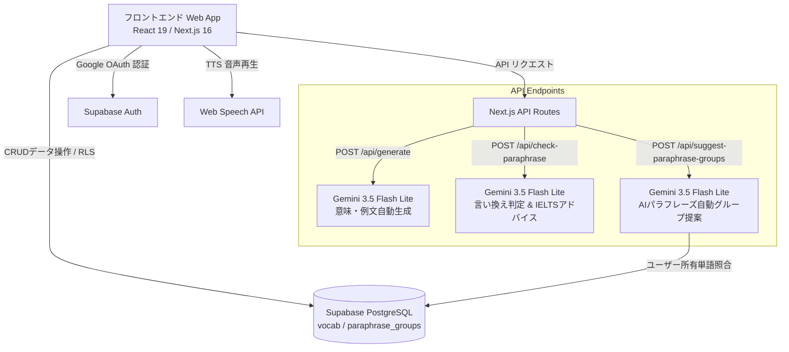

# 弱点単語集 (TOEIC / IELTS対策) システム仕様書

本仕様書は、弱点特化型英単語学習アプリケーション「弱点単語集」の全体設計、技術アーキテクチャ、データベース構造、主要機能、アルゴリズム、および外部API連携仕様について詳細に解説した技術ドキュメントです。

---

## 1. システム概要

### 1.1 開発目的とコンセプト
「弱点単語集」は、TOEICやIELTS等の英語試験対策において、ユーザー自身の苦手な英単語・言い換え表現（Paraphrase）・リスニングフレーズ・ライティング表現を集中的に登録・復習するためのウェブアプリケーションです。

単なる暗記カードにとどまらず、**エビングハウスの忘却曲線に基づく自動減衰（Decay）アルゴリズム**による復習期限管理と、**Google Gemini AI（LLM）** を活用した高精度な例文生成・意味取得・言い換え自動グループ化・IELTS特化型添削機能を特徴としています。

### 1.2 主要ターゲット・ユーザー体験
- **語学学習者（TOEIC / IELTS受験生）**: 模試や過去問で出遭過した「弱点単語」を即座に登録。
- **直感的なマルチモード復習**: 通常のカードめくりに加え、ライティング（英作文入力）およびパラフレーズ（類義語言い換えテスト）の専用復習モードを提供。
- **シームレスなAIサポート**: 例文作成の手間を排除し、AIが試験レベル・シチュエーションに応じた最適な英文・アドバイスを自動作成。

---

## 2. システムアーキテクチャ & 技術スタック

### 2.1 技術スタック一覧

| レイヤー | 技術 / ライブラリ | 概要・用途 |
| :--- | :--- | :--- |
| **フロントエンド** | React 19 / Next.js 16 (App Router) | 最新のReact/Next.js環境による高速SPA・SSRハイブリッド構成 |
| **言語** | TypeScript (v5) | 厳密な型安全性の確保 |
| **スタイリング** | Tailwind CSS (v4) / Vanilla CSS | ユーティリティファーストCSS、ダークモード対応 |
| **アニメーション** | Framer Motion (v12) | カードスワイプ、モーダル開閉、タブ切替の滑らかなUIアニメーション |
| **アイコン** | Lucide React | 直感的かつ統一されたデザインシステム |
| **自然言語処理 (NLP)** | Compromise (v14) | クライアントサイドでの動詞活用形・単複補正・テキスト正規化 |
| **音声合成 (TTS)** | Web Speech API (`SpeechSynthesis`) | 英語（en-US）の自動ボイス選択・発音読み上げ |
| **バックエンド / API** | Next.js API Routes | Node.jsサーバーレスエンドポイント |
| **AI (LLM)** | Google GenAI SDK (`@google/genai`) | AIモデル `gemini-3.5-flash-lite` による生成・判定処理 |
| **データベース / Auth** | Supabase (PostgreSQL / Supabase Auth) | 認証（Google OAuth）およびデータ永続化（Row Level Security対応） |

### 2.2 システム全体構成図



---

## 3. データベース設計 (Data Model & Schema)

データベースには Supabase (PostgreSQL) を採用し、ユーザーごとのデータを完全に隔離する **RLS (Row Level Security)** を適用しています。

### 3.1 `vocab` テーブル（単語データ）

ユーザーが登録した単語・フレーズの基本情報と復習ステータスを管理します。

| カラム名 | 型 | 制約 | 説明 |
| :--- | :--- | :--- | :--- |
| `id` | `uuid` | Primary Key, Default: `gen_random_uuid()` | 単語の一意ID |
| `user_id` | `uuid` | Foreign Key (`auth.users.id`), RLS対象 | 登録したユーザーのID |
| `term` | `text` | NOT NULL | 英単語・熟語・表現 |
| `meaning` | `text` | NOT NULL | 日本語の意味 |
| `context` | `text` | Default: `''` | 例文またはコンテキスト |
| `category` | `text` | NOT NULL | カテゴリ（`Vocab`, `Paraphrase`, `Listening`, `Writing`） |
| `status` | `int2` | NOT NULL, Default: `0` | 学習ステータス（`0` 〜 `5`） |
| `created_at` | `timestamptz`| Default: `now()` | 登録日時 |
| `review_due_at` | `timestamptz`| Nullable | 次回ステータス降格期限日時 |

#### 学習ステータス (`status`) と復習ロジック

| ステータス値 | 表面上の分類 | 保持期間 (降格日数) | 次の移行先 | 備考 |
| :---: | :---: | :---: | :---: | :--- |
| **0** | 未学習 | - | - | 初期登録状態 / 復習で「まだ」を選択時 |
| **1** | 学習中 | - | - | 復習で「覚えた」選択時の初期到達点 |
| **2** | 習得済み | **3日間** | `status = 1` | 3日経過後に自動降格 |
| **3** | 習得済み | **4日間** | `status = 2` | 4日経過後に自動降格 |
| **4** | 習得済み | **5日間** | `status = 3` | 5日経過後に自動降格 |
| **5** | 習得済み | **永続 (∞)** | - | 最高ステータス。降格なし |

### 3.2 `paraphrase_groups` テーブル（言い換えグループ）

`Paraphrase` カテゴリの単語同士をグループ化し、同義語・言い換え表現として関連付けるためのテーブルです。

| カラム名 | 型 | 制約 | 説明 |
| :--- | :--- | :--- | :--- |
| `id` | `uuid` | Primary Key, Default: `gen_random_uuid()` | 一意のグループ関連付けID |
| `user_id` | `uuid` | Foreign Key (`auth.users.id`), RLS対象 | ユーザーID |
| `vocab_id` | `uuid` | Foreign Key (`vocab.id`), Unique | 関連付ける `vocab` のID |
| `group_id` | `uuid` | NOT NULL | 所属するグループの一意識別子 |
| `created_at` | `timestamptz`| Default: `now()` | グループ化作成日時 |

---

## 4. 自動減衰アルゴリズム (Decay Logic)

人間が時間経過とともに記憶を減衰させるメカニズムを再現し、放置された単語を自動的に「復習対象」へ戻すアルゴリズムです。

### 4.1 アルゴリズム概要 (`processDecay`)
1. アプリケーション起動時および単語データロード時に `processDecay(vocabs)` が実行されます。
2. 対象：**`Writing` カテゴリ以外のカード** で、`review_due_at`（降格期限）が現在日時（`now()`）を過ぎているもの。
3. **段階的・連続降格処理**:
   - 長期間（数週間〜数ヶ月）放置された場合でも、1回のフェッチで経過期間に応じて段階的にステータスを降格させます。
   - 例: `status = 4` のカードが10日放置された場合:
     - Loop 1: `status = 4` → `status = 3` (`due_at` +5日分超過)
     - Loop 2: `status = 3` → `status = 2` (`due_at` +4日分超過)
     - ループ処理により適切なステータスと新たな `review_due_at` を一発で確定。
4. **バックグラウンド同期**: 変化があったカードは、UI描画を妨げない非同期バックグラウンド処理（`Promise.all`）で Supabase DB に一括反映されます。

---

## 5. 主要機能詳細仕様

### 5.1 登録モジュール (`InputView`)

#### (1) 単発登録 (Single Mode)
- **バリデーション**: 英字・スペース・ハイフン・アポストロフィのみ（最大30文字）。
- **AI 意味自動補完**: 単語を入力して「AIで意味を取得」をタップすると、Gemini API 経由で日本語の最も代表的な意味を即座に補完。
- **AI 例文自動生成**: 難易度レベル（初級 / 中級 / 上級）を選択可能。
  - TOEICビジネスメール・商談・広報、IELTS学術講義・環境問題・AI社会論説など **15種類のリアルな想定シチュエーション** からランダム割り当てを行い、実用的かつ多様な例文を1文で作成。
- **発音機能**: Web Speech API を用いたネイティブ発音再生。

#### (2) 一括登録 (Bulk Mode)
- タブ区切り・カンマ区切り・セミコロン区切りのテキストを一括パース。
- **Prompt コピーボタン**: ChatGPT や Claude に英文を渡して「単語・意味・例文」のタブ区切りリストを出力させるための最適化プロンプトをワンタップでクリップボードにコピー可能。
- **重複自動フィルタ**: `Writing` 以外のカテゴリで、既に登録済みの英単語（大文字小文字不問）が含まれていた場合は自動的にスキップし、重複登録を防止。

---

## 5.2 単語一覧・管理モジュール (`WordListView`)

- **フィルタ & 検索**:
  - 全文リアルタイム検索（英単語・意味・例文）
  - カテゴリ別フィルタ（Vocab / Paraphrase / Listening / Writing）
  - 内部ステータス（0: 未学習, 1: 学習中, 2: 習得済み）別フィルタ
- **編集・削除モーダル**:
  - 単語・意味・例文・カテゴリ・ステータスの変更
  - 編集画面内でも Gemini AI による意味・例文の再生成が可能
- **パラフレーズ手動グループ化**:
  - 複数単語を選択してグループを作成・解除。
  - グループ化した単語には 「G1」「G2」 等のカラーバッジが付与されます。
- **AI パラフレーズ自動提案 (`suggest-paraphrase-groups`)**:
  - 「AIグループ提案」をタップすると、ユーザーが登録した `Paraphrase` カテゴリの単語群を Gemini AI が分析。
  - TOEIC/IELTSで同じような文脈で言い換え可能な未グループの単語ペアを自動検知し、**「なぜ言い換え可能か」の日本語理由付き** で提示。
  - ユーザーは1タップでAIの提案を承認し、グループに追加可能。

---

## 5.3 復習・学習モジュール (`ReviewView`)

4つの復習モードと直感的なカードUIを提供します。

#### 復習モード一覧

| モード名 | 出題対象 | 学習ロジック・特徴 |
| :--- | :--- | :--- |
| **未習得** | `status` 0 および 1 のカード | 未学習(0) を優先出題し、完了後に 学習中(1) を出題。効率的な苦手克服。 |
| **すべて** | `status` 0 〜 5 の全カード | 総復習モード。 |
| **ライティング** | `Writing` カテゴリのカード | 入力テストモード。提示された意味・日本語から英語例文を入力。 |
| **パラフレーズ** | `Paraphrase` カテゴリのカード | 言い換えテストモード。提示された単語の類義語・言い換え語を自由入力。 |

#### 特殊判定ロジック

1. **Writing 入力判定 (`compromise` / AI)**
   - NLPライブラリ `compromise` を利用し、動詞の時制（過去形・進行形など）、名詞の単複・冠詞の差異を吸収して柔軟に正誤判定。
2. **Paraphrase AI 判定 (`check-paraphrase`)**
   - ユーザーが入力した言い換え語が、表示単語の言い換えとして適切かを Gemini AI がリアルタイム評価。
   - 単なる「YES/NO」判定だけでなく、**フォーマリティ（フォーマル度）、コロケーション、IELTSスコアへの影響に関する日本語アドバイス（1〜2文）** を提示。

---

## 5.4 設定・データ管理 (`SettingsModal`)

- **外観設定**: ライトモード / ダークモード切替（`data-theme` 属性による動的スタイリング）。
- **復習カスタマイズ**:
  - 1セッションあたりの出題数（10問 / 20問 / 50問 / すべて）
  - 出題順序（ランダム / 新しい順 / 古い順）
  - 自動音声読み上げ（カードめくり時の automatic speech）ON/OFF
- **バックアップ & 復元**:
  - カテゴリ指定可能な **CSV / TSV エクスポート**。
  - ファイルからの **CSV / TSV インポート**（既存データとの重複フィルタ付き）。
- **アカウント管理**: Google アカウントのログアウト。

---

## 6. エンドポイント仕様 (API Specification)

本システムが提供する Next.js API Routes の仕様です。

### 6.1 `POST /api/generate`
Gemini API を使用して単語の意味または例文を自動生成します。

- **リクエスト Body**:
  ```json
  {
    "term": "compromise",
    "type": "meaning" | "example",
    "level": "beginner" | "intermediate" | "advanced"
  }
  ```
- **レスポンス**:
  ```json
  {
    "result": "妥協する、歩み寄る"
  }
  ```

---

### 6.2 `POST /api/check-paraphrase`
パラフレーズ復習モードにおいて、ユーザーの入力した単語が適切かをAIが判定し、IELTSアドバイスを返します。

- **リクエスト Body**:
  ```json
  {
    "input": "yield",
    "displayedTerm": "concede",
    "meaning": "譲歩する",
    "context": "The company conceded to the demands."
  }
  ```
- **レスポンス**:
  ```json
  {
    "isValid": true,
    "hint": "どちらも「譲歩する」を意味する適切な言い換えです。concedeはよりフォーマルで、IELTS Writing Task 2のアカデミックな文脈で好まれます。"
  }
  ```

---

### 6.3 `POST /api/suggest-paraphrase-groups`
ユーザーの持つ `Paraphrase` カテゴリの単語をスキャンし、未グループの同義語ペアを検出・提案します。

- **ヘッダー**: `Authorization: Bearer <Supabase_JWT>` (ユーザーのRLSを通過させるため)
- **レスポンス**:
  ```json
  {
    "suggestions": [
      {
        "reason": "どちらも「獲得する」を意味し、TOEIC Readingで頻出の言い換え表現です。",
        "words": [
          { "id": "uuid-1", "term": "acquire", "meaning": "獲得する" },
          { "id": "uuid-2", "term": "obtain", "meaning": "入手する" }
        ]
      }
    ]
  }
  ```

---

## 7. 非機能要件 & セキュリティ

1. **データセキュリティ (RLS)**:
   - Supabase PostgreSQL の Row Level Security により、他ユーザーの単語データへアクセスすることは物理的に不可能です。
2. **API レートリミットハンドリング**:
   - Gemini API の 429 エラー（Quota 超過）を検知し、「1分ほど待ってからお試しください」といった親切なエラーメッセージを表示。
3. **音声フォールバック構造**:
   - ブラウザやOS（Chrome, macOS Safari, iOS Safari）ごとに利用可能な英語音声（`Google US English`, `Samantha`, `Evan` 等）を自動優先度でキャッシング・選択。

---

## 8. ディレクトリ構造

```text
src/
├── app/
│   ├── api/
│   │   ├── check-paraphrase/route.ts      # パラフレーズAI判定 API
│   │   ├── generate/route.ts              # 意味・例文AI生成 API
│   │   └── suggest-paraphrase-groups/     # パラフレーズ自動グループ提案 API
│   ├── globals.css                        # グローバルスタイル & Tailwind 設定
│   ├── layout.tsx                         # アプリケーション共通レイアウト
│   └── page.tsx                           # メインページ (タブ制御・認証状態管理)
├── components/
│   ├── InputView.tsx                      # 単語登録ビュー (Single / Bulk)
│   ├── WordListView.tsx                   # 単語一覧・グループ化・AI提案ビュー
│   ├── ReviewView.tsx                     # 復習ビュー (フラッシュカード/Writing/Paraphrase)
│   ├── SettingsModal.tsx                  # 設定・エクスポート・インポートモーダル
│   └── LoginView.tsx                      # ログインビュー (Google OAuth)
├── lib/
│   ├── settings.ts                        # LocalStorage 設定同期ユーティリティ
│   ├── speech.ts                          # Web Speech API (TTS) ユーティリティ
│   ├── supabase.ts                        # Supabase クライアント初期化
│   └── vocab.ts                           # 復習減衰(processDecay) & 重複チェックロジック
└── types/
    └── vocab.ts                           # 単語・カテゴリ・ステータスの型定義
```
